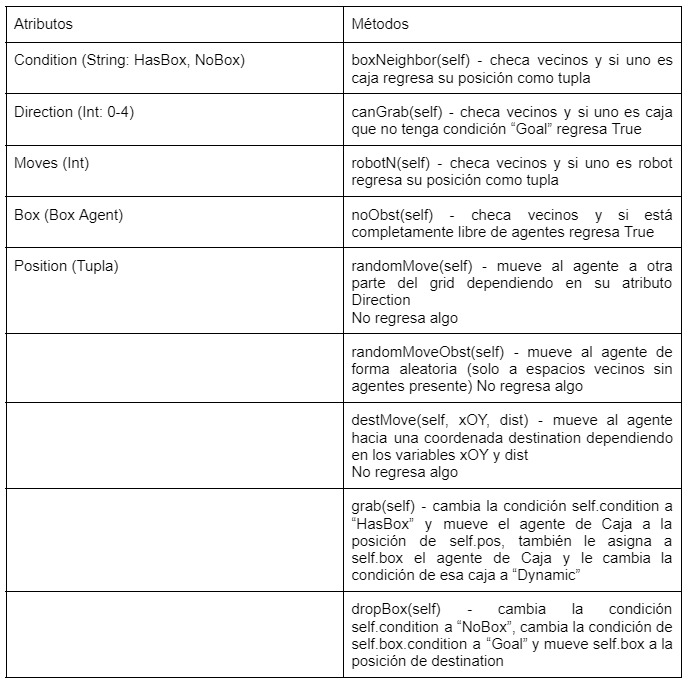
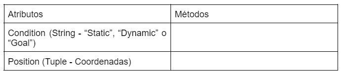
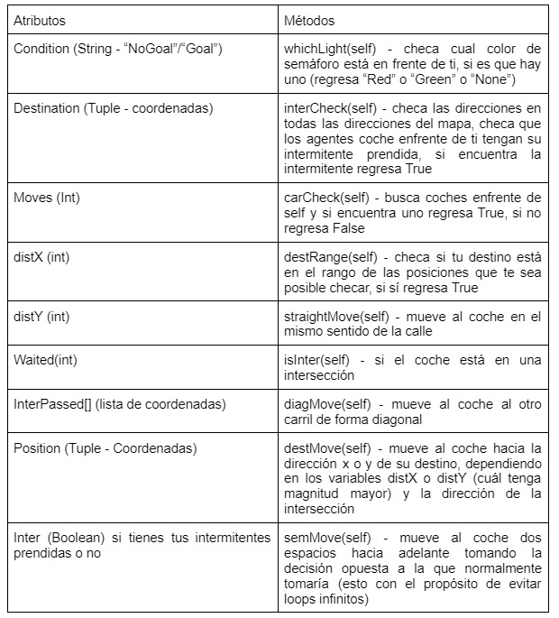
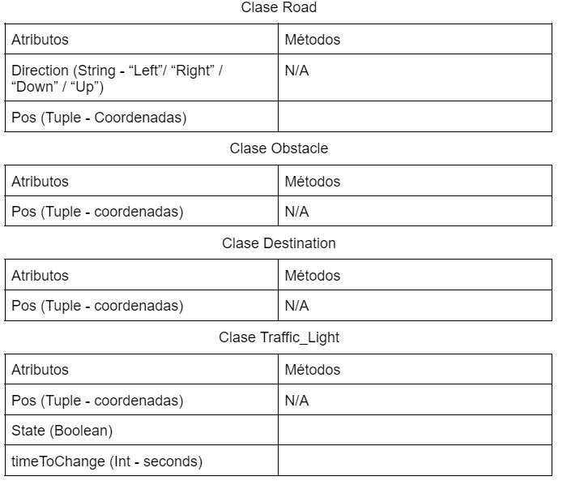

# Actividad Integradora: Robots
## Equipo 3

Carolina Ortega Barrios A01025254

Ian Seidman Sorsby A01028650

Ximena González Ibarra A01028604

## Diagramas de Clases:
Clase Robot

Clase Caja

### Protocolo de Agentes:
1. Sí el robot tiene caja y se encuentra en alguna de las dos celdas contiguas a la celda destino (o sea (1,0) o (0,1)), el robot deposita la caja en la celda destino (0,0)
2. Sí el robot tiene caja y no hay algún obstáculo en su camino, se hace una resta de las coordenadas destino menos las coordenadas de las posiciones para que el robot se dirija de forma directa.
3. Sí el robot no tiene caja, hay una caja en alguna celda y esa caja no tiene como condición “Goal”, el robot debe tomar la caja y llevarla a su misma celda (posición)
4. Sí el robot no tiene caja y hay un obstáculo en su camino, el robot crea una lista de tuplas con las posiciones disponibles y de esa misma lista toma una posición random.
5. Sí tiene caja y además hay un obstáculo en el camino, ocurre lo mismo que el paso anterior, se crea una lista de tuplas con las posiciones disponibles y de ahí se selecciona una posición random. 
6. Si no se cumple alguna de las instrucciones anteriores, el robot se mueve de manera aleatoria. 
Estrategia Cooperativa para la Solución del Problema
Tenemos 3 propuestas de mejora para que el modelo funcione de manera mucho más eficiente, claro que esto incluye la comunicación que pueden tener los robots entre sí.
1. La primera es que se vayan guardando las posiciones de los obstáculos (en este caso las cajas que hay en el grid) para que así los robots sean capaces de esquivar las posiciones en donde haya una caja obstáculo (en el caso de que cumplan la condición de que tienen una caja), y que los robots que estén disponibles sepan exactamente a donde ir en lugar de escoger una posición random hasta encontrar una caja.
2. Otra opción que pensamos es que los robots vayan guardando las posiciones visitadas, para que el robot le pueda dar prioridad a las otras celdas.
3. Lo ideal sería que los robots puedan darle prioridad a los robots que tienen una caja y van al destino, para que así puedan pasar mucho más rápido sin enfrentarse a más obstáculos.

# Reto: Movilidad Urbana
## Liga del Video
Liga al video: https://youtu.be/J5gtHZ_SVpE

## Diagramas de clase y protocolos de interacción finales.
Clase Car

### Protocolo de Agentes
Para el protocolo de agentes, se utilizan dos jerarquías, una “mini” jerarquía que se ejecuta antes de la jerarquía principal, esto con el propósito de tener información actual antes de tomar decisiones.

*“Mini” Jerarquía*

1. Si hay un semáforo con luz roja frente a ti: prende tus intermitentes
2. Si hay un semáforo con luz verde frente a ti y tienes tus intermitentes prendidas o tienes tus intermitentes prendidas y no hay nadie frente a ti con intermitentes prendidas: apaga tus intermitentes
3. Si tienes coches frente a ti con intermitentes prendidas: prende tus intermitentes

*Jerarquía Principal*

1. Si la condición del agente es diferente de “Goal”
2. Si el coche tiene su intermitente prendida, no se mueve
3. Si el destino está en tu rango:se mueve el agente coche al destino y cambia la condición a que llegó al “Goal”
4. Checa si hay un semáforo en frente y sea verde, si esto es el caso se mueve dos espacios en la dirección de la calle
5. Si el semáforo se encuentra en “Red” el coche tendrá que esperar un turno en su misma posición
6. Checa si no hay coches adelante o que lleva esperando más de un turno, y también debe estar en una intersección. Si esto es el caso el coche se mueve hacia su destino, en la dirección que esté más lejos en ese momento.
7. Checa si el coche está a 2 celdas en X y en Y del destino: moverá al coche en diagonal al otro carril
8. Checa si no hay un coche enfrente y si no hay el coche se mueve dependiendo la dirección de la calle
9. Checa si hay un coche enfrente: se espera un turno en la misma posición
10. Si no cumple ninguna de las condiciones anteriores se mueve en la dirección de la calle

*Guía de Instalación*

Se requiere descargar el zip desde la liga del repositorio “Sistemas_multiagentes” del equipo
Checar que se tiene instalado lo siguiente en el equipo:
Python 3.8 
Mesa
Flask
Unity (Versión 2020.3.22)
Cloud Foundry CLI

Desde el directorio TrafficBase/code se debe de hacer el deploy a la nube de IBM a través de Cloud Foundry:
	cf login (poner tus credenciales de IBM Cloud)
	cf api - <liga de servidor api> (elegir la liga más conveniente por ubicación)
	cf push
Finalmente, abrir el proyecto de Unity a través del folder “ProyectoCoche” y dentro de la escena BuildCity modificar el SerializeFields de AgentManager, cambiando el variable Url con la liga de tu programa en IBM Cloud
Correr el proyecto en Unity después de iniciar el programa de python en IBM Cloud.

1. *¿Por qué seleccionaron el modelo multiagentes utilizado? (mesa)*
- Utilizamos el modelo de multiagentes ya que por varios motivos cumplía con los requerimientos necesarios. Primero la librería “mesa” contiene un multigrid en donde se permite que varios agentes se encuentren en la misma posición. Utilizamos la jerarquía de operaciones para que el agente tenga prioridades en la toma de decisiones. Utilizamos varios agentes (coche, piso, edificio, semáforo) ya que todos tenían mínimo una condición que indicaba su estado. Al usar el modelo multiagentes, estos se pueden comunicar entre ellos a la hora de tomar decisiones, con el propósito de maximizar la ejecución. Con este modelo también se puede anticipar las consecuencias de las decisiones que tome el agente. 
2. *¿Cuáles fueron las variables que se tomaron al momento de tomar la decisión?*
A la hora de tomar decisiones el robot tomaba en cuenta las siguientes variables:
- su destino 
- si había una luz roja adelante
- si tenía las intermitentes prendidas
- si algún coche alrededor tenía las intermitentes prendidas
- si tenia algun coche en su camino
- la dirección de la calle
- si el coche esta en una intersección
- moverse en diagonal → cuando estas dos en x y dos en y de tu destino. 
3. *¿Cuál es la interacción de esas variables con respecto al resultado de la simulación?*
- con las coordenadas del agente y las coordenadas del destino se hace una resta. El eje que tenga la mayor distancia entre ambos agentes es el eje en el que el coche se movía. Por lo tanto si la distancia en “x” era mayor y la resta era positiva, el eje se movía una posición a la derecha, si era negativa se le restaba uno a su posición en “x”. Lo mismo pasaba con “y” en intersecciones y siguiendo la dirección de la calle.
- Las luces del semáforo le indican al agente si debe parar o seguir y si debe prender sus intermitentes o apagarlas, si este tiene las intermitentes prendidas y un coche queda detrás, el segundo va a parar y prender sus intermitentes para avisar a los agentes que vienen. Si está en verde el agente puede avanzar y apagar sus intermitentes.
- Las intermitentes evitan choques entre los agentes. 
- La dirección de la calle se debe seguir por ley. Por lo que siempre le damos prioridad. 
si se encuentra en una intersección y hay otro agente el coche se espera, si self.Waited llega a dos avanza. Así evitamos bucles infinitos, ya que ambos coches marcaban obstáculos y no avanzaban. 
4. *¿Por qué seleccionaron el diseño gráfico presentado?*
- El diseño gráfico seleccionado se utiliza porque tiene la ventaja de poder conectarse fácilmente a un servidor de Flask para representar los datos de forma actualizada mientras van cambiando. Unity también tiene la ventaja de ser mucho más visual que una simple visualización de Mesa y se puede personalizar para mostrar distintas cosas, como lo fue la ciudad para esta situación.
5. *¿Cuáles son las ventajas que encuentras en la solución final presentada?*
- La solución final tiene algunas ventajas sobre una ciudad real. A diferencia de una ciudad real, los coches siempre se mueven cuando deberían de manera instantánea, y no necesitan esperar a que los coches de enfrente se comiencen a mover. Esto evita que se acumule el tráfico completamente, y también trae beneficios como la habilidad de tener semáforos que pasen menos tiempo en verde y rojo para evitar la aglomeración de coches en un lado de la intersección. 
6. *¿Cuáles son las desventajas que existen en la solución presentada? ¿Qué modificaciones podrías hacer para reducir o eliminar las desventajas mencionadas?*
- La solución tiene algunas desventajas, dos en particular son fáciles de notar. Primero, un coche puede llegar a meterse a la misma intersección dos veces dependiendo de su destino, y solo a la segunda vez ya se da cuenta y toma la decisión opuesta para escapar del “loop infinito”. Esto se podría resolver tomando en cuenta otras variables además de la distancia de tu destino, como la estructura general de la ciudad, aunque eso requeriría un análisis a fondo de la ciudad en sí. Finalmente, si varios coches están presentes en una misma intersección con interés de ir a direcciones opuestas, se debe esperar un poco de tiempo antes de moverse para evitar colisiones, entonces puede ser más tardado de lo necesario. Esto se podría evitar utilizando un sistema de prioridad para que coches llegando de cierta dirección pasen primero siempre.

*Reflexión*

Al comenzar este bloque todos teníamos expectativas considerables sobre los temas que llegaríamos a ver, particularmente porque no teníamos mucha experiencia en estos. Sin duda se cumplieron las expectativas del aprendizaje básico de sistemas de multiagentes que esperábamos ver, y la conexión con Unity para representarlo de forma visual. Aún así, no falta mencionar que no fue fácil, ya que tuvimos que aprender todos los conceptos de teoría al comienzo y luego muy rápidamente comenzar a implementarlo en las últimas semanas. Estamos todos contentos con lo que logramos y verdaderamente creemos que sí pudimos cumplir con los objetivos y expectativas que tuvimos al comenzar hace 5 semanas.
	
Aún así, como equipo esperamos tener más seguimiento con el socio-formador de parte de IBM y sentimos que eso no se cumplió como esperábamos. El proyecto sí se pudo lograr como se planteó y se utilizó su herramienta de la nube de IBM para poder hacer la conexión del proyecto, pero realmente no tuvimos interacción con IBM en sí, más allá de una sesión informativa para ver cómo utilizar IBM Cloud. En general esperábamos tener más seguimiento con ellos, pero sabemos que esto se puede llegar a complicar con tan poco tiempo de bloqueo.
	
Generalmente fue un proceso de aprendizaje balanceado, comenzando con conceptos teóricos básicos y poco a poco ir probando con cosas más complejas. En cuanto al desarrollo del proyecto, si tuvimos momentos con complicaciones grandes, como lo fue la elaboración de la jerarquía (que tuvimos que modificar varias veces) y todas las funciones de movimiento necesarias para tomar en cuenta la multitud de casos distintos para la situación. Al igual tuvimos que probar constantemente con la conexión a Unity para asegurarnos que todo funcionara y se viera como se esperaba, aún cuando el sistema de multiagentes tenía fallas. A pesar de todo esto, si logramos elaborar el proyecto básico como se pidió y sentimos que nuestras expectativas si se cumplieron. El bloque en casi todos sus aspectos fue una gran experiencia de aprendizaje, aún con sus detalles.
